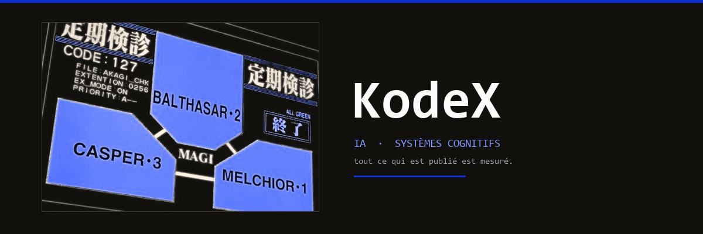

<div align="center">



<br/><br/>


<br/>

<a href="https://github.com/polmanas1998-star?tab=followers"></a>


</div>


## `~` whoami

```python
class KodeX:
    def __init__(self):
        self.role      = "fondateur · ingenieur IA"
        self.base      = "Paris, FR"
        self.stack     = ["Python", "FastAPI", "Next.js", "TypeScript"]
        self.obsession = "une architecture cognitive qui tient en production"

    def philosophie(self) -> str:
        return "un chiffre publie est un plancher ou un fait date"
```

- Je construis des systèmes d'IA faits pour la **production**, pas pour la démo : orchestration de modèles, mémoire persistante, instrumentation de bout en bout.
- Backend **Python / FastAPI**, front **Next.js**, inférence **LLM** en flux, le tout mesuré : chaque capacité publie son compteur et son dénominateur.
- Ce qui m'intéresse n'est pas d'écrire la capacité, c'est de prouver qu'elle **tire vraiment** en production.

<details>
<summary><b>Comment je travaille</b></summary>

<br/>

| Principe | En pratique |
| --- | --- |
| Câblage avant mécanique | Une capacité verte mais jamais appelée est une capacité morte |
| Mesure avant opinion | Tout ratio publie son dénominateur |
| Falsifiable | Un banc où personne ne peut perdre ne mesure rien |
| Daté | Un nombre exact sans date pourrit en silence |

</details>


## `~` ce que je mesure en ce moment

<div align="center">


</div>

<br/>

**La part du prompt qui parle de l'assistant, et non de vous.** Mesuree 30 fois,
ablation desarmee : le bloc d'identite et de style occupe **65,1 %** du prompt
systeme, mediane, bande 56,9 a 66,3. L'ecart n'est pas du bruit, c'est la **forme
de la question** : une question de raisonnement fait entrer d'autres blocs et
dilue l'identite de neuf points. Quatre valeurs contradictoires trainaient dans
mes notes parce qu'elles mesuraient des melanges de questions differents. Une
seule passe propre a suffi a les reconcilier.

**Une correction qui m'a coute.** J'ai publie un facteur **619x**. La vraie valeur
est **194x**. Une tache de fond que j'avais lancee et oubliee tournait encore
pendant la seconde mesure, et elle a ralenti les deux cotes inegalement. Seul le
point le plus court a bouge, celui sur lequel le ratio repose : mes points a
grand N etaient presque justes, 4,86 contre 5,08, et le resultat etait quand meme
faux d'un facteur trois. Corrige publiquement le jour meme.

<br/>

<div align="center">
<sub>un ratio est plus fragile qu'une valeur : je publie desormais ses deux bornes,<br/>pour qu'un lecteur puisse le recalculer sans moi.</sub>
</div>


## `~` stack

<div align="center">


<br/>


</div>


## `~` formations

<div align="center">


<br/><br/>

<sub>certificat de completion, cours eLearning Cybercrime, UNODC SPARK, 10 juillet 2026<br/>CS50, Harvard University</sub>

</div>


## `~` activite

<div align="center">


<br/><br/>

<sub>plancher mesure le 2026-08-24 sur le calendrier public de contributions</sub>

</div>

<!--
  GRAPHE D'ACTIVITE : retire apres mesure, ce n'est pas un oubli.

  github-readme-activity-graph.vercel.app repond 200 et dessine un graphe
  parfaitement forme, mais VIDE quand les requetes arrivent en rafale, ce qui
  est exactement la condition d'un vrai chargement de page.
  Mesure du 2026-08-24 :
    requete isolee        18622 octets, axe Y jusqu'a 16  -> vraies donnees
    rafale de 3 en //     16855 octets, axe Y jusqu'a 1   -> graphe vide (3/3)
  Rendu dans un navigateur : vide 2 fois sur 2. Le proxy d'images de GitHub
  met en cache la premiere reponse recue : un graphe plat resterait affiche
  des heures et donnerait l'image d'un compte inactif.

  Idem pour les cartes de statistiques :
    github-readme-stats.vercel.app    503  DEPLOYMENT_PAUSED
    github-profile-trophy.vercel.app  402  DEPLOYMENT_DISABLED
    github-readme-stats-sigma-five    200  mais rend "Maximum retries exceeded"
    streak-stats.demolab.com          200 puis 503 sur 3 essais consecutifs
  Un 200 ne suffit pas, il faut lire le rendu.

  Pour les reactiver durablement, heberger sa propre instance sur son compte
  Vercel (https://github.com/anuraghazra/github-readme-stats#deploy-on-your-own).
-->


## `~` le serpent mange mes commits

<div align="center">

<picture>
  <source media="(prefers-color-scheme: dark)" srcset="https://raw.githubusercontent.com/polmanas1998-star/polmanas1998-star/output/github-snake-dark.svg" />
  <source media="(prefers-color-scheme: light)" srcset="https://raw.githubusercontent.com/polmanas1998-star/polmanas1998-star/output/github-snake.svg" />
  
</picture>

</div>


<div align="center">

### `~` contact

<a href="https://github.com/polmanas1998-star"></a>
<a href="https://discord.com/users/1335570616753061995"></a>
<a href="https://discord.gg/discord-developers"></a>

<br/><br/>

<sub><i>tout ce qui est publié est mesuré.</i></sub>

</div>
